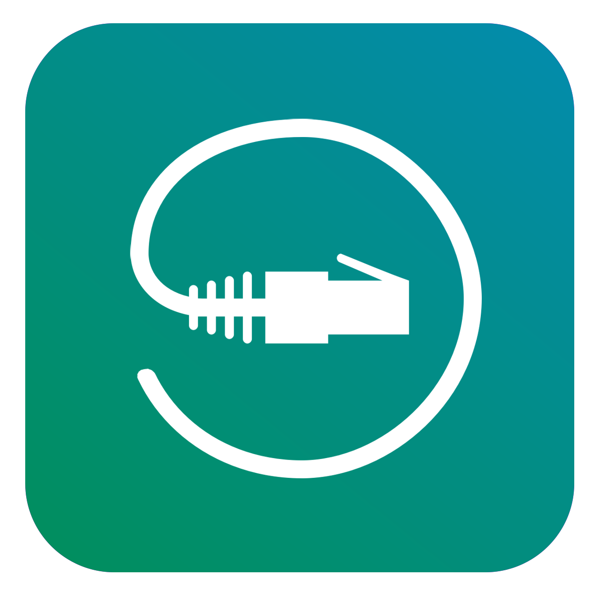

Hto3.NetworkHelpers
========================================

|Nuget Package|Build|Test Coverage|
|---|---|---|
|[](https://www.nuget.org/packages/Hto3.NetworkHelpers/)|[](https://travis-ci.org/HTO3/Hto3.NetworkHelpers)|[](https://codecov.io/gh/HTO3/Hto3.NetworkHelpers)|

Features
--------
Network helper methods.

### GetLocalIPAddresses

Get all lan IPv4 addreesses of this machine.

```csharp

```

### GetHostNameThroughIPAddressAsync

Get host name through IP address.

```csharp
```

### GetExternalIPv4AddressAsync

Get external IP address of this machine.

```csharp
```

### GetLocalIPv4AddressToReachInternet

Get the local ip address to reach the Internet.

```csharp
```

### ValidateCIDRIp

Validate a CIDR Ip string (i.e "10.0.0.0/24")

```csharp
```

### GetIpv4SubnetFromNetMask

This Function is Used to get Subnet based on NetMask (i.e 0-32).

```csharp
```

### IpAddressIsInRange

Check if the provided Ip is in range of the CIDR Ip.

```csharp
```

### IpAddressIsInPrivateAddressSpace

Check if the provided Ip is in the private address space.

```csharp
```

### IpAddressIsInPublicAddressSpace

Check if the provided Ip is in the public address space.

```csharp
```